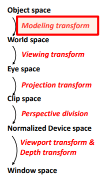
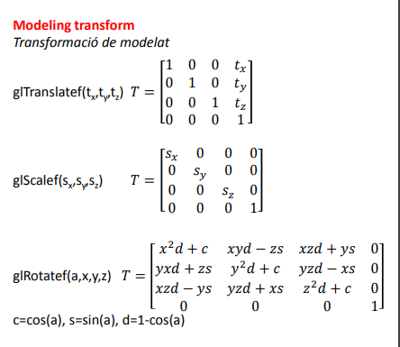

# Procés de visualitzación projectiu

### Esquema 

### Object Space 

- Sistema de coordenades utilitzat per modelar l'objecte
- W normalment serà:
  - 1.0 (PUNTS)
  - 0.0 (VECTORS)

### MODELLING TRANSFORM

Es situa cada instància d'un objecte en relació a l'escena, sol ser la identitat, una composicio de translacions, rotacions i escalats. 

**Matrius de transformació de Modelat**

### World Space

- Sistema de coordenades utilitzat per representar l'escena.
- La transformació de modelat sovint preserva la component homogènia i per tant, w normalment serà:
  - 1.0 (PUNTS)
  - 0.0 (VECTORS)

### VIEWING TRANSFORM

Transformació de visualització.

- Fa un canvi al sistema de referència de la càmera. 
- Depèn de la posició i orientació de la càmera.
- Sovint es defineix amb LookAt o amb translacions i rotacions.

### Eye Space

- Sistema de coordenades de l'observador/càmera.
- La transformació de visualització sovint preserva la component homogènia (1.0-punts, 0.0-vectors).

### PROJECTION TRANSFORM

- Depèn de la forma de la piràmide de visió i per tant del tipus de càmera(perspectiva, axonomètrica)

​				Càmara perspectiva

### Clip Space

Sistema de coordenades de retallat

- Si el punt és interior al frustum:
  - -w ≤ x ≤ w
  - -w ≤ y ≤ w
  - -w ≤ z ≤ w
- Si la càmera és perspectiva, llavors:
  - w = -z

### PERSPECTIVE DIVISION

El pas de coordenades homogènies a 3D, es divideix cada coordenada per la coordenada homogènia.

> (xc , yc , zc , wc) :arrow_right: (xc /wc , yc /wc , zc /wc )

### Normalized Device Space 

- Si un punt és interior al frustum: 
  - 1≤ x ≤ 1
  - -1 ≤ y ≤ 1
  - -1 ≤ z ≤ 1
- Els punts de Znear són -1 i els Zfar són 1

### VIEWPORT TRANSFORM & DEPTH TRANSFORM

- Viewport transformation
  - Transformació al dispositiu
  - Depèn del viewport amb glViewport
- Depth range transformation
  - Deprèn de l'interval definit amb glDepthRange 

### Window space

Coordenades de finestra/dispositiu

- Si el punt és interior al frustum:

  - 0 ≤ x ≤ w
    0 ≤ y ≤ h
    0 ≤ z ≤ 1

- Els punts situats sobre znear tenen:

  - z = 0

- Els punts situats sobre zfar tenen: 

  - z = 1 

  gl_FragCoord.w = 1/w = -1/z

# Pipeline OpenGL

1. Dibuix de primitives
2. Per-vertex operations
   1. Es transformen els vèrtexs (modelview i projection)
   2. Es transformen les normals
      1. Amb la transposta de l'inversa de la submatriu 3x3 de la modelView
   3. Es calcula la il·luminació del vèrtex
3. Primitive Assembly
   1. Els vèrtex s'agrupen en primitives
   2. Cada primitiva té un clipping diferent
4. Primitive Processing
   1. Clipping de la piràmide de visió
   2. Divisió de perspectiva: es divideix (x,y,z) per w
   3. Viewport & Depth transform :arrow_right: window coordinates
   4. Backface culling
      1. les normals estan en una altra direcció i no les pinto
5. Rasterització
   1. Es generen els fragments de les primitives
   2. Cada fragment té diversos atributs:
      1. Coordenades (window space)
      2. Color
      3. Coordenades de textura

6. Fragment processing ("shading")
   1. Càlcul del color del fragment (i.e. texture mapping)
7. Per-fragment operations ("raster operations")
   1. Stencil test, Pixel ownership test, Scissor test,  Alpha test, Stencil test, Depth test (test Z-buffer), Blending, Dithering, Logical Ops (glLogicOp)
8. Frame buffer operations 
   1. Es modifiquen els buffers que s'hagin escollit amb glDrawBuffers, afectada per glColorMask, glDepthMask...

# Ray Tracing

### Ray Tracing classic (LS\*E o LDS\*E)

Comença amb la càmara (E), i va rebotant a cada especular fins trobar una difusa

### Path Tracing (L(S|D)\*E)

Tira a saco de raigs per píxel i va pillant els reflexos de la especular i de la difusa n'agafa un qualsevol. Això provoca soroll.

### Two-path Ray Tracing (L\S*E o LS\*DS\*E)

Comença amb la càmara (E), i va rebotant a cada especular fins trobar una difusa i llavors pot continuar a rebotar en moltes especulars fins que arriba a a la llum