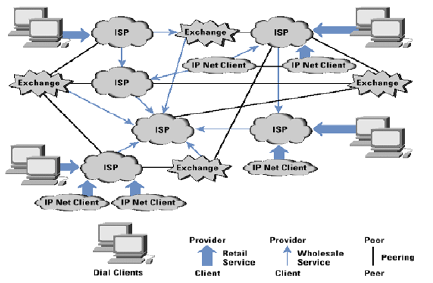

# Preguntes Exàmen PI

## 1. Internet Architecture & Addressing

**Pr1.** *Explica el rol y misión que tienen los RIR en la arquitectura de Internet. Indica cuantos y que RIR’s operan. Explica el rol que tienen los LIR en la arquitectura de Internet. Indica que relación hay entre un AS (Autonomous System) y un RIR y entre un AS y un LIR.*

RIR significa Regional Internet Registry, es una **organización** que supervisa la asignación y el registro de recursos de **números de internet** dentro una región particular del mundo. Los recursos incluyen IPs (v4 y v6) y números de sistemas autónomos. En un principio el registro de direcciones IP era un listado con la IP y los detalles de la organización a la que se había asignado. Con el crecimiento de la lista surgió IANA para regular la asignación pero como internet creció muy rápido, IANA no podía con la demanda de direcciones así que surgió la idea de hacer una administración de los recursos númericos a través de organizaciones a nivel regional, estableciendo así los RIR.

Un LIR es un Local Internet Registry, esta es una organización la cual dispone de **bloques de direcciones IP** asignadas des de un RIR. Las LIR suelen asignar las direcciones IP de las que disponen a sus clientes. Las LIR suelen ser **ISP, Empresas o instituciones académicas.** Un LIR siempre pertenece a un RIR.

Un **Sistema Autónomo (AS)** es un grupo de redes IP con una política de rutas propia e independiente. Cada AS realiza su propia gestión del tráfico que fluye entre él y los restantes Sistemas Autónomos que forman Internet. Se asigna a cada AS, un número (ASN) que lo identifica de manera única a sus redes dentro de Internet. Estos ASN estaban definidos por un entero de 16 bits hasta hace poco. Debido a la demanda se ha aumentado a 32bits y se escriben como un par de enteros x.y. Los números de Sistemas Autónomos son asignados en bloques por la  IANA a 
RIRs. Las entidades que  quieren recibir un número de sistema autónomo deben llenar un formulario ante el RIR correspondiente y ser aprobados antes que se le asigne el número de sistema autónomo.

------

**Pr2.** *A partir de la figura siguiente, explica la arquitectura de Internet y los distintos elementos que participan en dicha arquitectura, así como, el modelo general de negocio de dicha arquitectura.*

Los **ISP** dan servicio a los **clientes finales**
Los **ISP** intercambian rutas a través de relaciones de **peering**. - Protocolo B6Pv4

- Proveedor a cliente
- Cliente a proveedor
- Par a par sin tránsito
- Par a par con tránsito

Interconexiones ISP:

- Operador telecom
- Conexiones privadas.
- Puntos neutros

------

**Pr3.** *Explica para que sirve una CDN (Content Distribution Network) y explica su funcionamiento.*

Una **red de distribución de contenidos** es una red de computadoras que contienen copias de datos, colocados en varios puntos georáficos con el fin de maximizar el ancho de banda para el acceso a los datos de clientes por la red. Un cliente accede a la copia de la que se encuantra más cerca, a fin de evitar embudos en un servidor central. Las CDN emergen como la solución al actual problema que presenta una web centralizada: lograr bajo tiempo de respuesta y mínima pérdida de información, moviendo el contenido de la información más cerca de los usuarios.

- Se cuenta con un servidor de origen y un conjunto de servidores sustitutos para replicar el contenido.
- Usuarios solicitan directamente a los servidores sustitutos.
- Interactúa con el componente de distribución para mantener y actualizar el contenido
- Se mantiene el contenido entre el origen y los servidores sustitutos y asegura consistencia
- Mantiene registros de los accesos de los clientes y los registros de uso de los servidores.
- Ayuda a la presentación de informes de tráfico y facturación basada en el uso

------

**Pr4.** *Explica que es un punto neutro y quien lo compone. Explica que es la matriz de peering de un punto neutro. ¿Qué  condiciones hay que cumplir para ser miembro de un punto neutro?*

Un **punto neutro** o **punto de intercambio de Internet** (**IXP**, Internet Exchange Point) es una infraestructura física a través de la cual los ISP y CDNs intercambian el tráfico de Internet entre sus redes. Estas ubicaciones se encuentran en el "borde" de diferentes redes y permiten a los proveedores de red compartir el tránsito fuera de su propia red. Al tener presencia dentro de una ubicación IXP, las empresas pueden acortar su camino hacia el tránsito procedente de otras redes participantes, reduciendo así la latencia, mejorando el tiempo de ida y vuelta y reduciendo potencialmente los costos.

En su esencia, un IXP es esencialmente una o más ubicaciones físicas que contienen conmutadores de red que enrutan el tráfico entre los diferentes miembros. A través de diversos métodos, estas redes comparten los costes de mantenimiento de la infraestructura física y los servicios asociados.

La matriz de peering nos muestra quién esta conectado con quién en un IXP.

!FALTA PREGUNTA ULTIMA!

------

**Pr5**. *Define que es un SLA (Service Level Agreement). Indica aquellos parámetros que normalmente pueden formar parte de un SLA. ¿Qué ocurre si el ISP no cumple con alguno de los parámetros que aparecen en el SLA? ¿Y si es el usuario o red corporativa?*

Es un acuerdo escrito entre un proveedor de servicio y su cliente con objeto de fijar el nivel acordado para la calidad de dicho servicio. Es una herramienta que ayuda a ambas partes a llegar a un consenso en términos del nivel de calidad del servicio, en aspectos tales como **tiempo de respuesta, disponibilidad horaria, documentación disponible, personal asignado al servicio, etc**.

------

**Pr6.** *Explica que representa el Cono de Clientes (“Customer Cone”) respecto a las direcciones IPv4 y los AS y para que se utiliza. Ilústralo con un ejemplo. ¿Qué diferencia hay entre el cono de clientes de un AS y su grado en la representación mediante un grafo donde los vértices son los AS’s y las aristas son las relaciones entre AS’s?*

------

**Pr7.** *Define e indica que representa el cono de clientes (“Customer Cone”) respecto a las direcciones IPv4 y los AS#. Dibuja una nueva figura respecto a la figura de abajo, con el nuevo cono de clientes si (i) A y B (A es proveedor de B) cambian su relación a “A y B tienen una relación de peer to peer”, (ii) A y B (A es proveedor de B) cambian su relación a “B es proveedor de A”. Indica cual es el “peering cone size ratio” para el AS B en el caso de la figura y en los casos (i) y (ii).*

------

**Pr8.** *¿Qué es un Sistema Autónomo (AS)? ¿Qué diferencia hay entre usar inter-domain e intra-domain routing en un AS? Explica los tipos de relaciones que tienen los AS’s.*

Un **Sistema Autónomo (AS)** es un grupo de redes IP con una política de rutas propia e independiente. Cada AS realiza su propia gestión del tráfico que fluye entre él y los restantes Sistemas Autónomos que forman Internet. Se asigna a cada AS, un número (ASN) que lo identifica de manera única a sus redes dentro de Internet.

Inter-domain (between domains) es qualquier tipo de protocolo de routing que se ha establecido entre dos redes diferentes, por lo que permetiría comunicarse entre diferenes AS considerando que internet consiste en una colección de AS interconectados; el principal protocolo utilizado es BGP. Un intra-domain reside dentro el propio AS, ignora el internet de fuera el AS; Protocolos como RIP o OSPF.

------

**Pr9.** *En una relación BGP, ¿Qué rutas anuncia un ISP cliente a su  proveedor?, ¿Y el proveedor a su cliente? ¿Y de par a par de transito? ¿Y de par a par de no-transito?*

